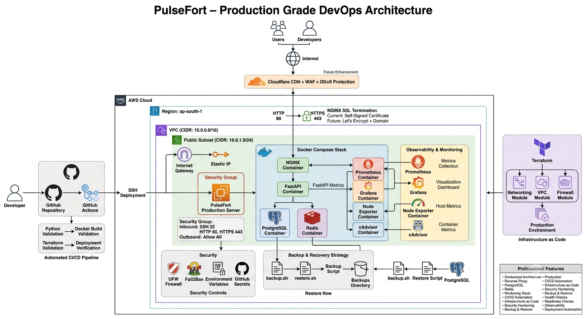
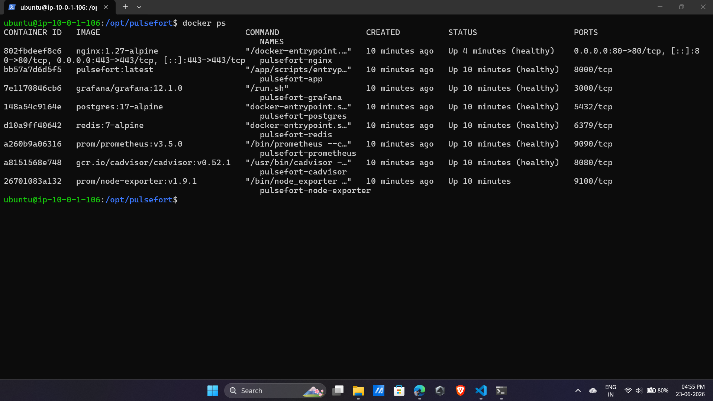
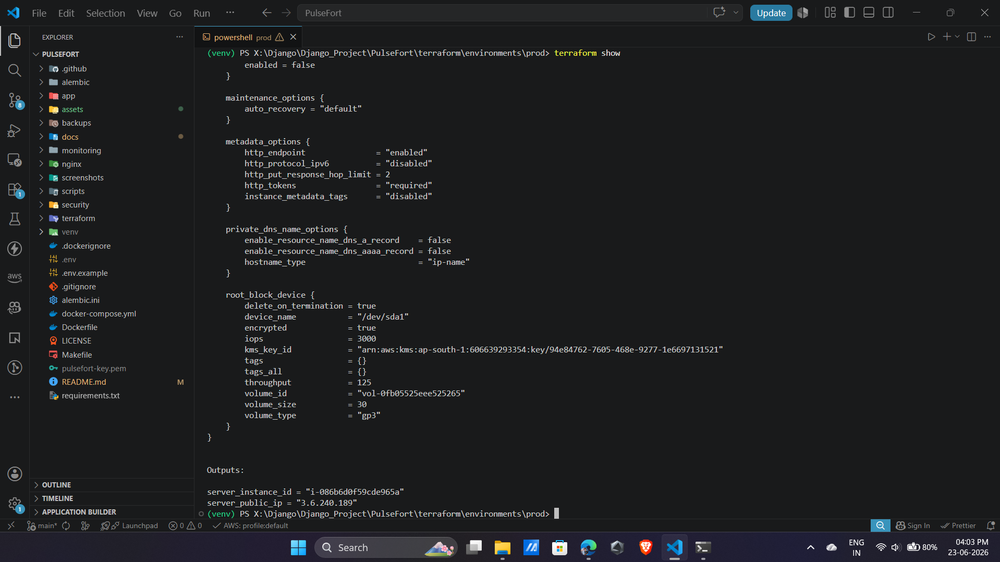
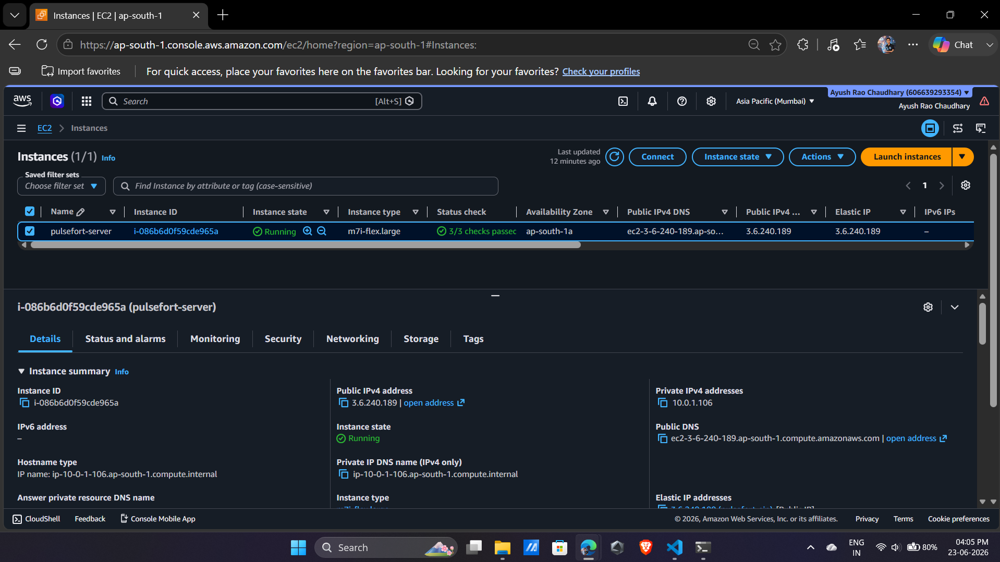
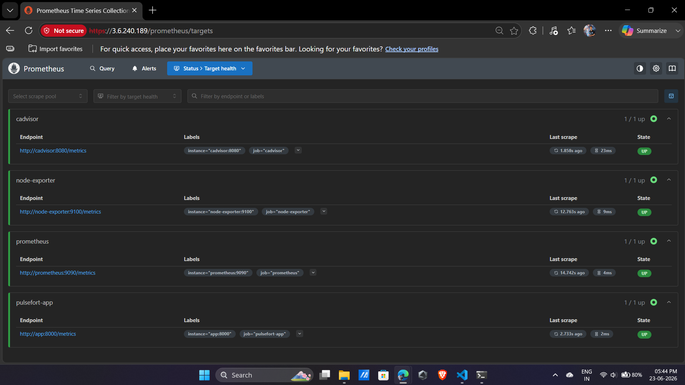
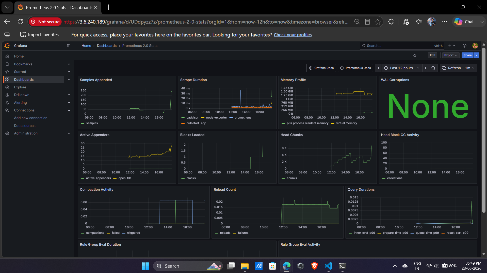
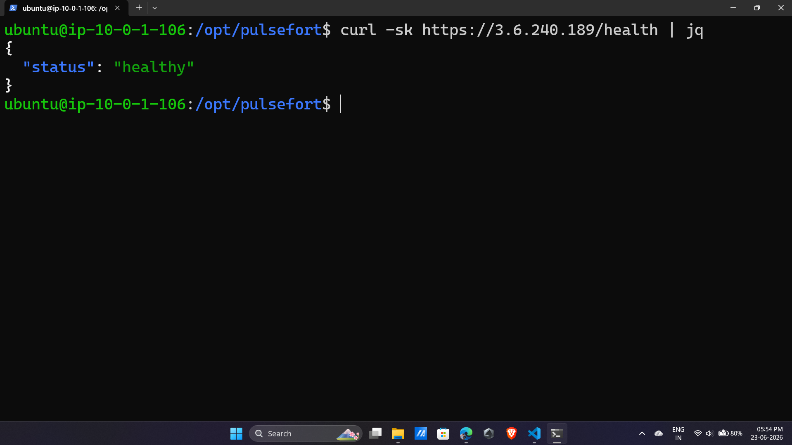
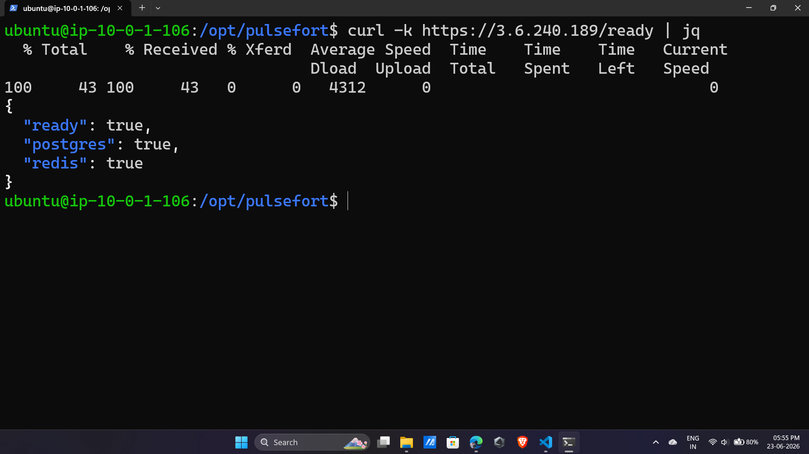
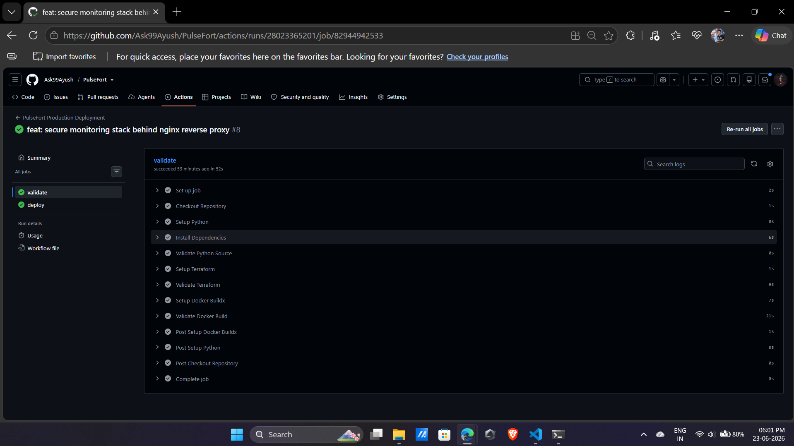

# PulseFort

### A Production-Grade Backend Platform Demonstrating Real-World DevOps and Platform Engineering Practices

---

## Table of Contents

1. [Executive Summary](#1-executive-summary)
2. [Why PulseFort Exists](#2-why-pulsefort-exists)
3. [Production Challenges Addressed](#3-production-challenges-addressed)
4. [Solution Overview](#4-solution-overview)
5. [Architecture Diagram](#5-architecture-diagram)
6. [Technology Stack](#6-technology-stack)
7. [Platform Capabilities](#7-platform-capabilities)
8. [API Capabilities](#8-api-capabilities)
9. [Infrastructure Architecture](#9-infrastructure-architecture)
10. [Container Architecture](#10-container-architecture)
11. [Infrastructure as Code](#11-infrastructure-as-code)
12. [Monitoring and Observability](#12-monitoring-and-observability)
13. [Security Architecture](#13-security-architecture)
14. [Reliability Engineering](#14-reliability-engineering)
15. [Backup and Recovery](#15-backup-and-recovery)
16. [CI/CD Pipeline](#16-cicd-pipeline)
17. [Documentation](#17-documentation)
18. [Getting Started](#18-getting-started)
19. [Why PulseFort Stands Out](#19-why-pulsefort-stands-out)
20. [Future Enhancements](#20-future-enhancements)
21. [Closing Notes](#21-closing-notes)

---

## 1. Executive Summary

PulseFort is a production-oriented backend platform engineered to demonstrate how modern software services are deployed, monitored, secured, automated, and operated in real cloud environments.

The application layer is intentionally kept lightweight. The focus of this project is not on building a complex business application, but on building the **operational foundation** around it: containerization, infrastructure automation, reverse proxy configuration, observability, deployment automation, backup and recovery workflows, security hardening, and day-to-day operational readiness.

PulseFort exists to answer one question most tutorial projects never address: what does it actually take to run software reliably in production, not just write it. Every component in this repository, from the Terraform modules to the Grafana dashboards, answers that question with working, reproducible infrastructure rather than theory.

---

## 2. Why PulseFort Exists

Most backend projects stop at "the API works on my machine." PulseFort starts there and keeps going, into the territory that separates a prototype from a production system.

This project was built to:

- Demonstrate hands-on command of the full DevOps lifecycle, not just isolated tools
- Provide a reference implementation that mirrors patterns used in real engineering organizations
- Show how Infrastructure as Code, containerization, observability, and security come together as one cohesive platform, instead of disconnected demos
- Serve as a practical, inspectable proof of operational engineering skill, backed by real deployed infrastructure and real screenshots, not slideware

PulseFort is deliberately infrastructure-first. The FastAPI service exists to give the platform something real to monitor, secure, and operate, not the other way around.

---

## 3. Production Challenges Addressed

Running software in production requires significantly more discipline than writing business logic. Engineering teams continuously face challenges such as:

| Challenge Area | Description |
|---|---|
| Infrastructure Provisioning | Standing up cloud resources reliably and repeatably |
| Environment Consistency | Eliminating "it works on my machine" failures |
| Deployment Automation | Shipping changes without manual, error-prone steps |
| Service Observability | Knowing what is happening inside the system at any time |
| Health Monitoring | Detecting failures before users do |
| Dependency Management | Ensuring databases, caches, and services stay in sync |
| Security Hardening | Reducing attack surface across every layer |
| Incident Response | Having a defined process when something breaks |
| Backup and Recovery | Protecting against data loss and enabling fast restoration |
| Operational Reliability | Keeping the system available despite failures |
| Configuration Management | Managing secrets and environment variables safely |
| Deployment Validation | Confirming a release is actually healthy before calling it done |

Without proper automation and operational controls, systems become increasingly fragile and difficult to maintain as infrastructure grows. PulseFort was built specifically to demonstrate how these challenges are addressed in a real, working environment.

---

## 4. Solution Overview

PulseFort combines application services, infrastructure automation, observability tooling, security controls, deployment workflows, and operational processes into a single, unified platform.

| Capability | Implementation |
|---|---|
| API Layer | FastAPI |
| Database | PostgreSQL |
| Cache Layer | Redis |
| Reverse Proxy | NGINX |
| Monitoring | Prometheus |
| Visualization | Grafana |
| Host Metrics | Node Exporter |
| Container Metrics | cAdvisor |
| Containerization | Docker |
| Service Orchestration | Docker Compose |
| Infrastructure as Code | Terraform |
| Deployment Automation | GitHub Actions |
| Security Controls | UFW, Fail2Ban |
| Backup and Recovery | Automated Scripts |
| Cloud Infrastructure | AWS |

The result is a production-style environment capable of demonstrating the complete lifecycle of deploying and operating modern backend services, from a developer's commit to a monitored, secured, and recoverable production deployment.

---

## 5. Architecture Diagram

The architecture is designed around operational simplicity, service isolation, observability, and deployment automation.

<p align="center">
  
</p>

---

## 6. Technology Stack

**Application Layer**

| Component | Technology |
|---|---|
| API Framework | FastAPI |
| Validation | Pydantic |
| ORM | SQLAlchemy |
| Database Migrations | Alembic |
| ASGI Server | Uvicorn |

**Data Layer**

| Component | Technology |
|---|---|
| Primary Database | PostgreSQL |
| Cache Layer | Redis |

**Infrastructure Layer**

| Component | Technology |
|---|---|
| Cloud Provider | AWS |
| Compute | EC2 |
| Networking | VPC |
| Infrastructure as Code | Terraform |

**Container Platform**

| Component | Technology |
|---|---|
| Container Runtime | Docker |
| Orchestration | Docker Compose |

**Networking Layer**

| Component | Technology |
|---|---|
| Reverse Proxy | NGINX |
| HTTPS Strategy | Self-Signed SSL (Development) |
| Future SSL | Let's Encrypt |

**Monitoring Stack**

| Component | Technology |
|---|---|
| Metrics Collection | Prometheus |
| Dashboards | Grafana |
| Host Monitoring | Node Exporter |
| Container Monitoring | cAdvisor |

**CI/CD and Automation**

| Component | Technology |
|---|---|
| Source Control | GitHub |
| CI/CD Platform | GitHub Actions |
| Deployment Automation | SSH-Based Deployment |

**Security**

| Component | Technology |
|---|---|
| Firewall | UFW |
| Intrusion Protection | Fail2Ban |
| Secret Management | Environment Variables |
| Deployment Secrets | GitHub Secrets |

---

## 7. Platform Capabilities

PulseFort demonstrates a broad set of capabilities commonly required for production systems.

**Infrastructure Automation**
Reproducible infrastructure across environments, full Infrastructure as Code coverage, automated server provisioning, and standardized, consistent environments.

**Deployment Automation**
Continuous Integration on every change, Continuous Delivery to production, automated validation before deployment, and post-deployment verification.

**Service Operations**
Fully containerized services, managed service dependencies, persistent storage for stateful services, and automatic service recovery.

**Observability**
Infrastructure-level monitoring, application-level monitoring, host metrics collection, container metrics collection, and centralized dashboard visualization.

**Security**
Firewall configuration at the host level, SSH hardening, Fail2Ban brute-force protection, centralized secret management, and non-root container execution.

**Reliability**
Continuous health monitoring, liveness checks, readiness checks, documented backup and restore procedures, and operational runbooks for incident response.

---

## 8. API Capabilities

The application layer intentionally remains lightweight while still providing enough functionality to demonstrate database connectivity, caching, monitoring, and health validation under real conditions.

**Service Endpoints**

| Method | Endpoint | Description |
|---|---|---|
| GET | `/` | Service information |
| GET | `/health` | Health status |
| GET | `/live` | Liveness verification |
| GET | `/ready` | Dependency readiness |
| GET | `/metrics` | Prometheus metrics |

**User Management**

| Method | Endpoint |
|---|---|
| POST | `/users` |
| GET | `/users` |
| GET | `/users/{id}` |
| DELETE | `/users/{id}` |

Provides basic CRUD operations against PostgreSQL.

**Cache Operations**

| Method | Endpoint |
|---|---|
| POST | `/cache` |
| GET | `/cache/{key}` |

Demonstrates Redis integration and cache validation in a real request path.

---

## 9. Infrastructure Architecture

PulseFort is deployed on AWS infrastructure that is provisioned entirely through Terraform, with no manual console steps.

Core infrastructure components include:

- Virtual Private Cloud (VPC)
- Public Subnet
- Route Tables
- Internet Gateway
- Security Groups
- EC2 Instance
- Elastic IP

The infrastructure layer provides a consistent and reproducible deployment environment while maintaining clear separation between application services, networking, monitoring, and operational tooling. Any environment can be torn down and rebuilt identically from code.

---

## 10. Container Architecture

The platform operates as a multi-container environment managed through Docker Compose.

**Application Services**

| Service | Responsibility |
|---|---|
| FastAPI | API layer |
| PostgreSQL | Persistent data |
| Redis | Cache layer |
| NGINX | Reverse proxy |

**Observability Services**

| Service | Responsibility |
|---|---|
| Prometheus | Metrics collection |
| Grafana | Visualization |
| Node Exporter | Host monitoring |
| cAdvisor | Container monitoring |

This architecture enables service isolation, simplified deployments, easier maintenance, and full operational visibility across the platform.

<p align="center">
  
</p>

---

## 11. Infrastructure as Code

Infrastructure provisioning is handled entirely through Terraform using a modular architecture.

**Networking Module** — VPC creation, subnet provisioning, route management.

**VPS Module** — EC2 provisioning, Elastic IP assignment, bootstrap automation.

**Firewall Module** — Security group configuration, inbound access rules, outbound policies.

**Production Environment** — Environment configuration, variable management, deployment consistency across runs.

<p align="center">
  
</p>

<p align="center">
  
</p>

---

## 12. Monitoring and Observability

Operational visibility is a foundational component of PulseFort. Every production system should provide actionable insight into application behavior, infrastructure health, service dependencies, and resource utilization.

PulseFort includes a dedicated observability stack that enables engineers to monitor system performance, troubleshoot incidents, validate deployments, and identify operational bottlenecks before they become outages.

**Monitoring Architecture**

```text
FastAPI Metrics
       |
       v
  Prometheus
       |
       v
    Grafana

Node Exporter --> Prometheus
cAdvisor      --> Prometheus
```

**Prometheus**

Prometheus acts as the central metrics collection platform for the entire stack.

- Application Metrics: request volume, endpoint activity, application availability, health status
- Infrastructure Metrics: CPU utilization, memory consumption, disk usage, network activity
- Container Metrics: container CPU usage, container memory usage, container network statistics, runtime information

**Grafana**

Grafana provides operational dashboards and visualization capabilities on top of Prometheus data, covering infrastructure health, application health, container statistics, host resource usage, service availability, and deployment monitoring. Grafana transforms raw metrics into meaningful operational insight that helps engineers understand platform behavior in real time.

**Production Exposure Model**

Grafana is exposed through NGINX over HTTPS, while Prometheus, Node Exporter, and cAdvisor remain accessible only within the internal Docker network. This reduces attack surface and follows common production monitoring practices.

**Node Exporter**

Node Exporter provides host-level metrics directly from the EC2 instance, including CPU usage, memory usage, disk utilization, filesystem statistics, network throughput, and system load.

**cAdvisor**

cAdvisor provides container-level monitoring across the platform, including resource consumption, container lifecycle events, CPU allocation, memory allocation, network utilization, and filesystem usage.

<p align="center">
  
</p>

<p align="center">
  
</p>

---

## 13. Security Architecture

Security is implemented throughout the platform using multiple layers of protection, designed to reduce attack surface and improve operational safety at every level.

**Infrastructure Security**

The infrastructure layer implements network-level controls to restrict access and isolate services: AWS Security Groups, restricted inbound access, controlled network exposure, and Elastic IP access management.

Public access is limited to:

```text
22   SSH (restricted to trusted administrator IPs)
80   HTTP
443  HTTPS
```

All internal services remain inaccessible from the public internet and are reachable only within the internal Docker network.

**Host Security**

The operating system layer is protected using standard hardening techniques.

- UFW Firewall: provides host-level traffic filtering, allowing only explicitly approved ports
- Fail2Ban: protects against SSH brute-force attacks, repeated authentication failures, and automated login attempts
- SSH Hardening: key-based authentication only, reduced attack surface, administrative access control

**Container Security**

Container security is enforced through runtime isolation and least-privilege principles: non-root containers, isolated runtime environments, minimal service exposure, and internal-only service networking.

**Secret Management**

Sensitive values are never committed to source control under any circumstances. Secrets are managed using environment variables, GitHub Actions secrets, and Terraform variables, covering database credentials, Redis configuration, deployment secrets, and monitoring credentials.

---

## 14. Reliability Engineering

Reliability is treated as a core requirement of PulseFort, not an optional feature bolted on afterward. The platform incorporates operational safeguards designed to improve service stability and deployment confidence.

**Health Checks**

| Endpoint | Purpose |
|---|---|
| `GET /health` | Verifies overall application availability |
| `GET /live` | Verifies that the application process itself is running correctly |
| `GET /ready` | Validates critical dependencies (PostgreSQL, Redis) before declaring the service ready |

**Restart Policies**

Docker restart policies provide automatic service recovery after failures, without manual intervention, covering container crashes, host reboots, and unexpected service failures.

**Deployment Validation**

Deployments are validated using readiness checks before being considered successful, preventing broken releases from reaching production silently. Validation includes application startup, database connectivity, Redis connectivity, and health verification.

**Operational Runbooks**

Documented operational procedures provide clear guidance for incident response, recovery operations, service validation, and troubleshooting.

<p align="center">
  
</p>

<p align="center">
  
</p>

---

## 15. Backup and Recovery

Backup and recovery procedures are included to support operational resilience and disaster recovery, treating data protection as a first-class operational concern.

**Backup Strategy**

Database backups are generated using automated scripts on a repeatable schedule, with PostgreSQL backups, timestamped backup files, consistent backup structure, and recovery-oriented design.

```text
PostgreSQL
      |
      v
 backup.sh
      |
      v
 Backup Storage
```

**Restore Strategy**

Database restoration is performed through a dedicated, tested recovery workflow.

```text
Backup Storage
      |
      v
 restore.sh
      |
      v
 PostgreSQL
```

**Operational Benefits**

Faster recovery from failure, reduced data loss risk, a repeatable recovery process, and genuine disaster recovery readiness, not just a backup file sitting unused.

---

## 16. CI/CD Pipeline

PulseFort uses GitHub Actions to automate validation and deployment workflows end to end. The pipeline is designed to reduce manual operations while increasing deployment consistency and reliability.

**Validation Stage**

Every change is validated before it is allowed anywhere near production: source code validation, Docker build validation, Terraform validation, and configuration validation.

**Deployment Stage**

After validation succeeds, the pipeline proceeds automatically through application deployment, service restart, health verification, and readiness validation.

**Deployment Flow**

```text
Developer Commit
       |
       v
GitHub Repository
       |
       v
GitHub Actions
       |
       v
Validation -> Build -> Deployment
       |
       v
Health Verification
       |
       v
Production Release
```

**Deployment Benefits**

Reduced manual intervention, consistent and repeatable deployments, faster releases, improved reliability, and fully repeatable operations from commit to production.

<p align="center">
  
</p>

---

## 17. Documentation

Detailed implementation and operational documentation is available within the `docs` directory.

| Document | Description |
|---|---|
| [Architecture Guide](docs/architecture.md) | Platform architecture and design |
| [Deployment Guide](docs/deployment.md) | Infrastructure and deployment procedures |
| [Security Guide](docs/security.md) | Security controls and hardening |
| [Monitoring Guide](docs/monitoring.md) | Monitoring and observability stack |
| [Backup Guide](docs/backup.md) | Backup and recovery procedures |
| [Operations Runbook](docs/runbook.md) | Operational procedures and troubleshooting |

Each document is intended to be read independently and covers its respective domain in full operational depth.

---

## 18. Getting Started

**Clone Repository**

```bash
git clone https://github.com/Ask99Ayush/PulseFort
cd PulseFort
```

**Configure Environment**

```bash
cp .env.example .env
```

Update configuration values as required for your environment.

**Build Services**

```bash
docker compose build
```

**Start Platform**

```bash
docker compose up -d
```

**Verify Deployment**

```bash
curl http://localhost/health
curl http://localhost/ready
```

**Access Monitoring**

```text
Grafana Dashboard:
https://YOUR_SERVER_IP/grafana/

Prometheus:
Internal-only monitoring service.
Accessible from the Docker network and operational validation workflows.
Not exposed publicly.
```

---

## 19. Why PulseFort Stands Out

Many backend portfolio projects demonstrate a working API and stop there. PulseFort is built to stand apart by treating the operational layer as the primary deliverable:

- **Infrastructure-First Design** — Every piece of infrastructure is provisioned through code, not console clicks, and can be rebuilt identically at any time.
- **Real Observability, Not a Dashboard Screenshot** — Prometheus and Grafana are wired into live application, host, and container metrics, not mock data.
- **Defense in Depth** — Security is enforced at the network, host, and container level simultaneously, not as a single afterthought.
- **Proof Over Claims** — The Project Gallery section exists specifically to provide visual evidence that the platform actually runs, deploys, and recovers as described.
- **Operational Maturity** — Health checks, readiness checks, restart policies, and documented runbooks reflect how real production systems are kept reliable.
- **End-to-End Automation** — From a developer commit to a verified, healthy production release, the entire path is automated and repeatable.

PulseFort is built to be read, inspected, and run, not just described.

---

## 20. Future Enhancements

Planned enhancements for the platform include:

- Cloudflare integration
- Full domain-based HTTPS
- Let's Encrypt certificate automation
- Advanced deployment strategies (blue-green, canary)
- Automated backup scheduling
- Container registry integration
- Multi-environment deployments (staging, production)
- Enhanced Grafana dashboards
- Alerting and notification pipelines
- Web Application Firewall integration

---

## 21. Closing Notes

PulseFort represents a practical implementation of modern DevOps, Cloud Engineering, and Platform Engineering practices.

The platform demonstrates how infrastructure automation, deployment workflows, observability, security controls, backup strategies, and operational tooling work together to support reliable software delivery, end to end.

Rather than focusing solely on application functionality, PulseFort emphasizes the operational foundations required to build, deploy, secure, monitor, and maintain production systems effectively.

This project serves as a comprehensive demonstration of infrastructure-first engineering, showcasing the technologies, workflows, and operational disciplines used in modern cloud environments today.

---
